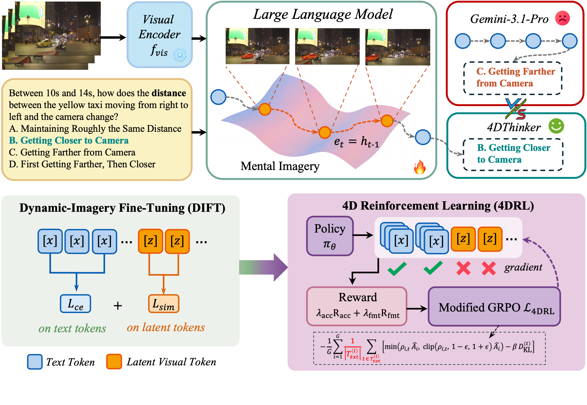
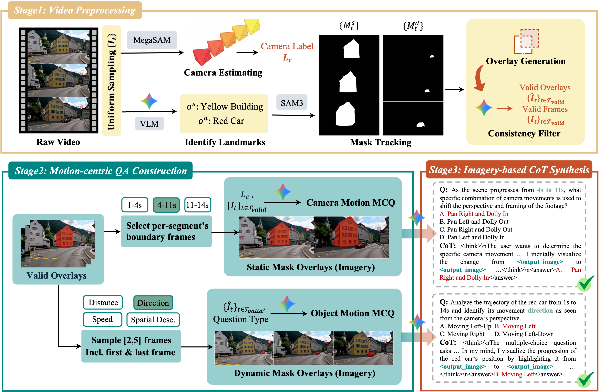

<div align="center">
<h1>4DThinker: Thinking with 4D Imagery for Dynamic Spatial Understanding</h1>
</div>

<a href="https://arxiv.org/pdf/2510.18632"></a>
<a href="https://huggingface.co/papers/2510.18632"></a>
<a href="https://huggingface.co/datasets/jankin123/4DThinker-Training-Data"></a>
<a href="https://huggingface.co/jankin123/4DThinker-3B"></a>
<!-- <p align="center">
  🤗 <b>2.0 <a href="#models">Models</a></b> · <b><a href="#datasets">Datasets</a></b> · <b><a href="#citation">Technical Report</a></b>
</p> -->

## Overview



## Introduction
Dynamic spatial reasoning from monocular video is essential for bridging visual intelligence and the physical world, yet remains challenging for vision-language models (VLMs). Prior approaches either verbalize spatial-temporal reasoning entirely as text, which is inherently verbose and imprecise for complex dynamics, or rely on external geometric modules that increase inference complexity without fostering intrinsic model capability. In this paper, we present 4DThinker, the first framework that enables VLMs to "think with 4D" through dynamic latent mental imagery, i.e., internally simulating how scenes evolve within the continuous hidden space. Specifically, we first introduce a scalable, annotation-free data generation pipeline that synthesizes 4D reasoning data from raw videos. We then propose Dynamic-Imagery Fine-Tuning (DIFT), which jointly supervises textual tokens and 4D latents to ground the model in dynamic visual semantics. Building on this, 4D Reinforcement Learning (4DRL) further tackles complex reasoning tasks via outcome-based rewards, restricting policy gradients to text tokens to ensure stable optimization. Extensive experiments across multiple dynamic spatial reasoning benchmarks demonstrate that 4DThinker consistently outperforms strong baselines and offers a new perspective toward 4D reasoning in VLMs.

## Project Structure

```
4DThinker/
├── README.md
├── LICENSE.txt
├── .gitignore
├── dift/                        # DIFT training code
│   ├── src/                     # main.py, trainer.py, task.py, utils.py, inference.py
│   ├── transformers/            # Custom Qwen2.5-VL transformers fork
│   ├── configs/                 # DeepSpeed configs (ds_zero2.json, ds_zero3.json)
│   ├── train.sh                 # Multi-GPU training script
│   ├── train_single_gpu.sh      # Single-GPU training script
│   └── requirements_dift.txt
├── 4drl/                        # 4DRL (GRPO) training code
│   ├── src/open-r1-multimodal/  # RL trainer package
│   ├── transformers_rl/         # Custom transformers fork for RL
│   ├── trl/                     # Modified trl package
│   ├── run_scripts/             # train_4dthinker.sh
│   ├── configs/                 # DeepSpeed configs
│   └── requirements_4drl.txt
├── evaluation/                  # DSR benchmark evaluation
│   ├── dsr_eval.py
│   ├── batch_dsr_eval.sh
│   └── results/                 # Evaluation output
├── preprocess/                  # Data generation pipeline
│   ├── run.sh                   # Entry point: loops process_minibatch.py
│   ├── process_minibatch.py     # Frame extraction + SAM3 masks + object detection
│   ├── merge_jsonl.py           # Merge per-video data.jsonl
│   ├── generate_camera_qa.py    # Camera movement QA + CoT
│   ├── generate_dynamic_qa.py   # Object motion QA + CoT
│   ├── convert_format.py        # Convert to training JSONL format
│   ├── check_output_image.py    # Validate <output_image> tags
│   └── sam3/                    # SAM3 segmentation model
├── data/                        # [HuggingFace] Training data (JSONL on GitHub; media on HuggingFace)
│   ├── dift_data.jsonl          # DIFT training data (38K samples)
│   ├── 4drl_data_filtered.jsonl # 4DRL training data (37K samples)
│   └── processed_data/          # Video frames & masks
├── raw_data/                    # [HuggingFace] Evaluation benchmark data
└── model/                       # [HuggingFace] Model checkpoints
    ├── dift/                    # DIFT checkpoint
    └── 4drl/                    # 4DRL checkpoint
```

> **Note**: `data/`, `raw_data/`, and `model/` are hosted on HuggingFace due to their large size. See the respective HuggingFace repositories for download instructions.

## Env Setup

### Preprocess Environment (optional)

```bash
cd preprocess/sam3
pip install -e .
```

### DIFT Environment

```bash
conda create -n 4dthinker python=3.10 -y
conda activate 4dthinker

pip install -r dift/requirements_dift.txt
cd dift
pip install -e ./transformers/
```

### 4DRL Environment

```bash
conda create -n 4dthinker-rl python=3.10 -y
conda activate 4dthinker-4drl

pip install -r 4drl/requirements_4drl.txt
cd 4drl
pip install -e ./transformers_rl/
cp -rf ./trl $(python -c "import site; print(site.getsitepackages()[0])")/trl
# Install RL trainer
pip install -e ./src/open-r1-multimodal/
```

## Data Preprocessing

The `preprocess/` directory contains the full annotation-free data generation pipeline. Starting from raw SpatialVID videos, it produces structured 4D reasoning data (CoT interleaved with dynamic mental imagery).

### Pipeline Overview


### Prerequisites

- SAM3 model checkpoint at `preprocess/sam3/models/sam3.pt`
- SpatialVID data (videos + annotations + metadata CSV)
- OpenAI-compatible API access (for Gemini-based QA generation)

### Usage

```bash
cd preprocess

# Set environment variables
export OPENAI_API_KEY=your_api_key
export OPENAI_BASE_URL=https://api.openai.com/v1
export DATA_BASE_DIR=/path/to/your/data

# Step 1: Process videos (frame extraction + SAM3 masks + object identification)
# This script loops automatically until all videos are processed.
bash run.sh

# Step 2: Merge per-video results into a single JSONL
python merge_jsonl.py

# Step 3: Generate motion QA pairs with imagery-based CoT
python generate_camera_qa.py    # Camera motion questions
python generate_dynamic_qa.py   # Object motion questions

# Step 4: Convert to training format and validate
python convert_format.py ./camera_data_qa_all.jsonl ./camera_qa_converted.jsonl
python convert_format.py ./dynamic_data_qa_all.jsonl ./dynamic_qa_converted.jsonl
python check_output_image.py ./camera_qa_converted.jsonl
python check_output_image.py ./dynamic_qa_converted.jsonl
```

## Training

### DIFT Training
```bash
conda activate 4dthinker
bash dift/train.sh

OR

bash dift/train_single_gpu.sh
```

Key arguments:
- `MODEL_PATH`: Path to Qwen2.5-VL-3B-Instruct base model
- `DATA_PATH`: Path to `dift_data.jsonl`
- `--latent_size`: Number of latent tokens per image (default: 4)
- `--ce_weight` / `--sim_weight`: Loss weights (default: 0.1 / 1.0)

### 4DRL Training

```bash
conda activate 4dthinker-4drl
bash 4drl/run_scripts/train_4dthinker.sh
```

Key arguments:
- `MODEL_PATH`: Path to DIFT checkpoint directory
- `DATA_PATH`: Path to `4drl_data_filtered.jsonl`

## Inference

see `dift/src/inference.py`

## Evaluation
On DSR benchmark:

```bash
conda activate 4dthinker
# Single model evaluation
CUDA_VISIBLE_DEVICES=0 python evaluation/dsr_eval.py \
    --model_path model/dift/checkpoints \
    --benchmark_path ./raw_data/DSR_Suite-Data/benchmark.parquet \
    --video_root ./raw_data/DSR-data/bmk_video \
    --latent_size 4

# Batch evaluation (multiple checkpoints in parallel)
bash evaluation/batch_dsr_eval.sh
```
